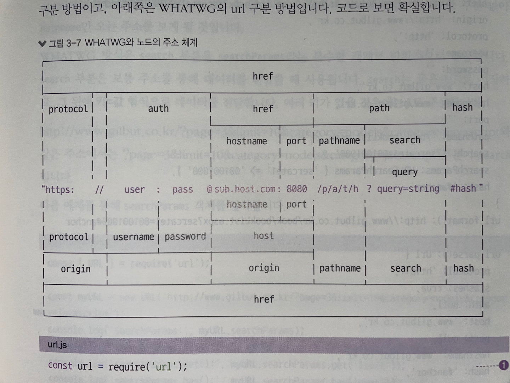

# NodeJS 교과서  by 제로초
[github 소프코드](https://github.com/gilbutITbook/080229)
[깃헙 제로초](https://github.com/zerocho/nodejs-book)

## ch2 알아두어야할 자바스크립트

### 2.1.7 프로미스(Promise)
- 
- Es2015 부터  자바스크립트와 노드는 API들이 콜백대신 프로미스기반으로 재구성 횐다. 프로미스 매우 중요! 
- 프로미스는 : 실행은 바로 하되, 결과값은 나중에 받는 객체. 결과 값은 실행이 완료된후 then, catch 메서드를 통해 받음!
- 코드를 바같으로 뺴낼수 잇음! 
- 코드를 치고, then()으로 불러온다! 콜백은 여전히 스콥 안에서 실행!
- 프로미스를 왜 쓰는가? 어떤 동작을 한다. 그 동작이 성공 또는 실패가 가능하기 떄문에! 어떤 파일을 읽어와! 또는 네이버에 요청을 하고 와! 이럴떄 성공 또는 실패가 있다. 요청이 실패할수 있기 때문에..비동기는 실패할수 잇는코드를 작성! 


    1) 프로미스 객체 생성
    ```
    const promise = new Promise((resolve, reject) => {
        if (condition) {
            reolve('success');
        } else {
            reject('failed');
        } 
    });
    promise
        .then((msg) = {
            console.log(msg); //성공 (resolve)한 경우 실행
        })
        .catch((err) => {
            console.error(err);  //실해 (reject)한 경우 실행
        })
        .finally(() => {
            console.log("무조건 실행됨!)   //무조건 실행!!
        })
    ```
### 2.1.8 async / await 
- try / catch 사용한다! 트라이가 리졸브 역활, 리젝트는 캣치가 한다!
- await 이 프로미스의 then 역활을 한다!
```
const findAndSaveUser = async (Users) => {
    try {
        let user = await Users.findOne({});
        user.name = 'Azimut';
        user = await user.save();
        user = await Users.findOne({getnder: 'male'});
    } catch (err) {
        console.error(err);
    }
};
```

### 3.3 모듈로 만들기
- require(./var.js)   # 같은 폴더
- require(../var.js)  # 부모 폴더  
- 모듈 사용할때 구조분해하여  속성명 변수명 넘어가도 같아야 한다!
- 다만, 함수명은 리콰이어 할때 뱐수로 받기때문에 넘겨받은 함수명은 변경 가능하다!

## ch3 노드 기능 알아보기
### 3.3 모듈 만들기
### 3.4 노드 내장객체 알아보기

#### - 3.4.6.2 process.nextTick(콜백)
- 이벤트 루프가 다른 콜백 함수들 보다 nextTick의 콜백 함수를 우선처리함!
- 넥스트틱과 프로미스를 마이크로태스크라고 따로 구분! 테스크vs마이크로테스크

#### - 3.4.6.3 process.exit(코드)
- 실행중인 노스 프로세스를 종료! 특수 상황 제외하고는 잘 사용 안함
- 독립적인 프로그램을 수동으로 멈출때 사용!


### 3.5 노드 내장 모듈 사용하기
#### 3.5.1 os
-  자바스크립트는 운영체제 정보를 가져 올수 없다
- 노드는 가능하다! 
```
const os = require('os');
os.arch() 등등
```

#### 3.5.3 URL   <searchParams vs queryString>
- 가운데 주소 기준으로 위쪽은 기존 노드 url
- 아래쪽은 WHATWG 의 url 구분방법!

- url 모듈안에 URL 생성자 있음! 이 생성자에 주소를 넣어 객체로 만들면 주소가 부분별로 정리!
- url.parse(adress) : 주소를 분해! 속성 확인! username,password vs auth 등!!
- url.foramt(객체) : WHATWG 방식과 url 과 기존 노드의 url 모두 사용간으! 분해 했던 url 객체를 원래 상태로 조립! 
- toString() : 조작한 searchParams 객체를 다시 문자열로 반환!

#### 3.5.4 queryString
- querystring.parse(쿼리) : url의 query 부분을 자바스크립트 객체로 분해 합니다.
- querystring.stringify(객체) : 분해된 쿼리 객체를 다시 문자열로 조립 합니다.


## ch4  http 모듈로 서버 만들기

### 4.1 요청과 응답 이해하기
- 웹브라우져(클라이언트)  --> 요청 req --> 노드 서버
- 웹브라우져(클라이언트)  <-- 응답 res <-- 노드 서버
- 브라우져는 응답 내용을 받아 렌더링
` res.end('<p>end method: hello Server</p>');` 
-  end 종료 메서드.  인자 있으면, 클라이언트로 보내고 응답 종료!

### 4.2 REST 와 라우팅 사용하기
- 서버에 요청을 보낼때는 주소를 통해서 요청의 내용을 표현!
- 주소 한개로 요청 메서드를 여러개 가질수 잇음!
    - GET 메서드의 /user 주소로 요청을 보내면 사용자 정보를 "가져오는" 요청!
    - POST 메서드의 /user 주소로 요청을 보내면 사용자 정보를 "등록" 요청!   