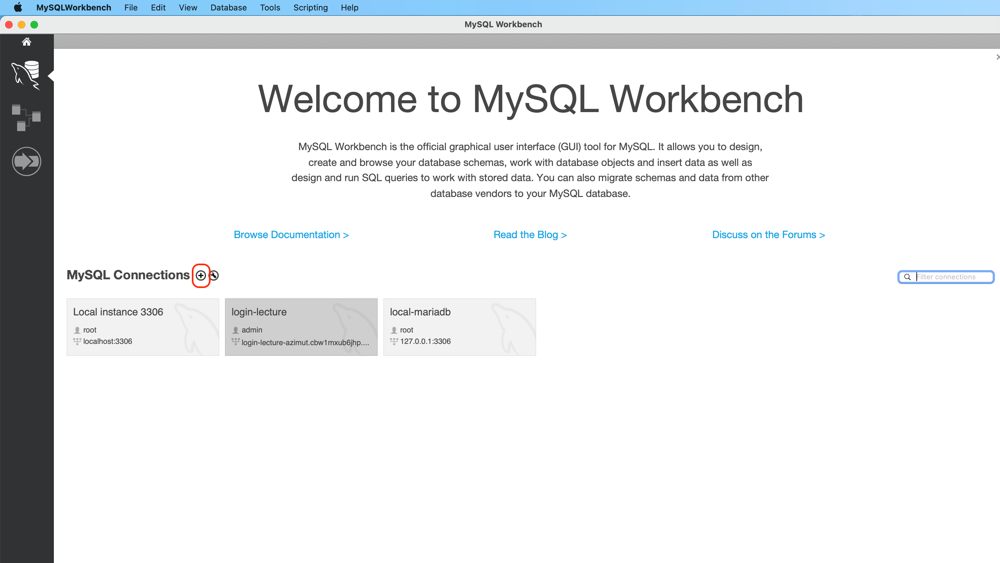

## ch7. MySQL 
### 7.1 데이터 베이스란!

#### 7.2.2 MAC MySQL 설치
```
1) homebrew 설치 (만약 설치 안했으면)
2) mysql 설치
  1. 설치
    brew install mysql
  2. mysql 시작
    brew services start mysql   
  3.루트 비번 설정 _ 유효성 비번 설치 물으면 n(실습에서는)
    mysql_secure_installation   
  4. mysql 접속
    mysql -h localhost -u root -p 
```
### 7.3 워크벤치 설치하기
#### 7.3.2 MAC 워크벤치 설치
  - `brew cask install mysqlworkbench`

#### 7.3.4 커넥션 생성하기 (워크벤치)
- (+)버튼 클릭.

-  커넥션 네임 === localhost
- 비번 (스토어 인 볼트) : 비번 적고
- 로컬호스트 디비 이름 클릭!  커넥션 성공!

### 7.4 데이터베이스 및 테이블 생성하기
#### 7.4.1 테이서 베이스 생성하기
- `CREATE SCHEMA [데이터 베이스 이름]`
-  스키마는 데이터베이스와 같은 개념! 
```
mysql> CREATE SCHEMA 'nodejs' DEFAULT CHARACTER SET utf8;
mysql> use nodejs;
```
- ; 세미콜론을 붙이면 실행됨! 그렇지 않으면 프롬프트가 다음 줄로 넘어가서 다른 입력이 들어 오는 것을 기다림!
- CREATE SCHEMA 와 같은 것을 예약어라 함. 소문자도 가능! 그러나 컨벤션! 대문자로 쓴다!

#### 7.4.2 테이블 생성하기
```
MySQL [nodejs]> CREATE TABLE nodejs.users (
    -> id INT NOT NULL AUTO_INCREMENT,
    -> name VARCHAR(20) NOT NULL,
    -> age INT UNSIGNED NOT NULL,
    -> married TINYINT NOT NULL,
    -> comment TEXT NULL,
    -> created_at DATETIME NOT NULL DEFAULT now(),
    -> PRIMARY KEY(id),
    -> UNIQUE INDEX name_UNIQUE (name ASC))
    -> COMMENT = '사용자 정보'
    -> DEFAULT CHARACTER SET = utf8
    -> ENGINE = InnoDB;
```
  - CREATE TABLE [데이터베이스명.테이블명]
  - CREATE TABLE nodejs.users  (nodejs 생략 가능, 위에 디비 생성 햇기 때문)
  - 옵션은 페이지 298 참고
  - 테이블 확인 명령어
    - `DESC users;`
  - 테이블 제거 명령어
    - `DROP TABLE users;`
  
  ```
MySQL [nodejs]> CREATE TABLE nodejs.comments (
    -> id INT NOT NULL AUTO_INCREMENT,
    -> commenter INT NOT NULL,
    -> comment VARCHAR(100) NOT NULL,
    -> created_at DATETIME NOT NULL DEFAULT now(),
    -> PRIMARY KEY(id),
    -> INDEX commenter_idx (commenter ASC),
    -> CONSTRAINT commenter
    -> FOREIGN KEY (commenter)
    -> REFERENCES nodejs.users (id)
    -> ON DELETE CASCADE
    -> ON UPDATE CASCADE)
    -> COMMENT = '댓글'
    -> DEFAULT CHARSET=utf8mb4
    -> ENGINE=InnoDB;
  ```
  - 테이블 보기 명령어
    - `SHOW TABLES;`
  
### 7.5 CRUD 작업하기
#### 7.5.1 CREATE(데이터 생성)
- 데이터 생성하기
  - `INSERT INTO comments (commenter, comment) VALUES ('1', '노드 교과서 공부중, 댓글 태스트 울트라맨');`
  - `INSERT INTO 테이블명 (칼럼1, 칼럼2,...  칼럼n) VALUES (값1, 값2 ...);`

#### 7.5.2 Read(조회)
- `SELECT * FROM nodejs.users;`
- `SELECT * FROM nodejs.comments;`
  - 특정 칼럼 조회
    - `SELECT name, married FROM nodejs.users;`
  - 결혼하고, 나이30세 이상! 사용자 조회
    - `SELECT name, age FROM nodejs.users WHERE married = 1 AND ange > 30;`
- 페이지 310-311 참고

### 7.5.3 Update(수정)
- `UPDATE nodejs.users SET comment = '바꿀 수정 수정 업댓 내용' WHERE id = 2;`
    
### 7.5.4 Delete(삭제)
- `DELETE FROM nodejs.users WHERE id=2;`

## 7.6 시퀄라이즈 사용하기
- `npm i express morgan nunjucks sequelize sequelize-cli mysql2`
  - mysql2  는 시퀄라이즈 와 mysql 을 이어주는 드라이버이다. 
- `npm i -D nodemon`
- `npx sequelize init` 

### 7.6.3 관계 정의하기.
- 사용자 한명은 댓글 여러개 가능! but 댓글 한개는 사용자가 단 한명(여려명 불가)
- 이러한 관계를 1:N 관계 (사용자 1, 댓글 N)
- 다른 예, 일대일 또는 다대다 관계
- 1:1 관계로는 사용자와 사용자에 대한 정보 테이블. 정보 테이블도 한사람을 가리킨다.
- N:M 관계로는 게시글 테이블과 해시태그(#) 테이블 관계가 있다. 한 게시글에 해시태그가 여러개 달릴수 있고, 한 해시태그에 여러 게시글이 달릴수 잇다. 

#### 7.6.3.1  (1 : N)
- hasMany 메서드 사용  <--> belongsTo 메서드 사용
  - `db.User.hasMany(db.Comment, { foreignKey: 'commenter', sourceKey: 'id' });`
  - `db.Comment.belongsTo(db.User, { foreignKey: 'commenter', targetKey: 'id' }`

```
                        1      :      N

                            hasMany
                      User < ------ > Comment
                            belongsTo
```
- 다른 모델의 정보가 들어 있으면 belongsTo

#### 7.6.3.2 (1:1)
- hasOne 메서드 사용
- `db.User.hasOne(db.Info, { foreignKey: 'UserId', sourceKey: 'id'});`
- `db.User.belongsTo(db.User, { foreignKey: 'UserId', targetKey: 'id'});`

#### 7.6.3.3 (N:M)
- `db.Post.belongsToMany(db.HashTag, { through: 'PostHashtag' });`
- `db.HashTag.belongsToMany(db.Post, { through: 'PostHashtag' });`

### 7.6.4  쿼리 알아보기
  - p.329 ~ 332

#### 7.6.4.1 관계 쿼리 

### 7.6.5 쿼리 수행하기

~시작~